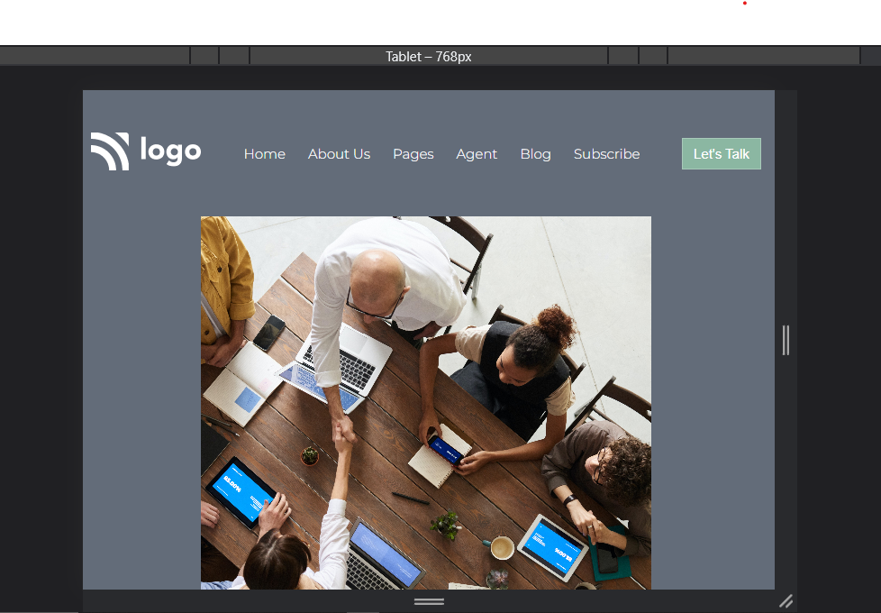
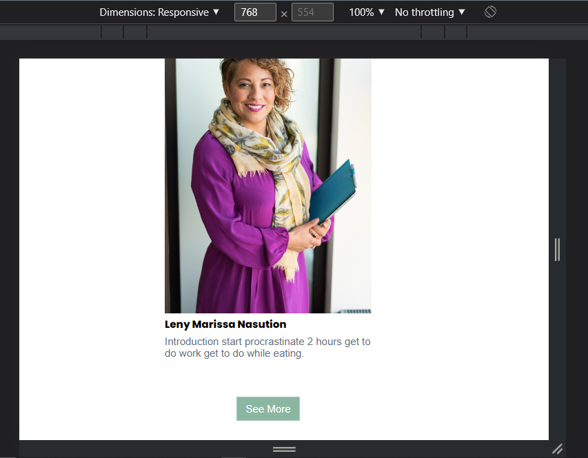
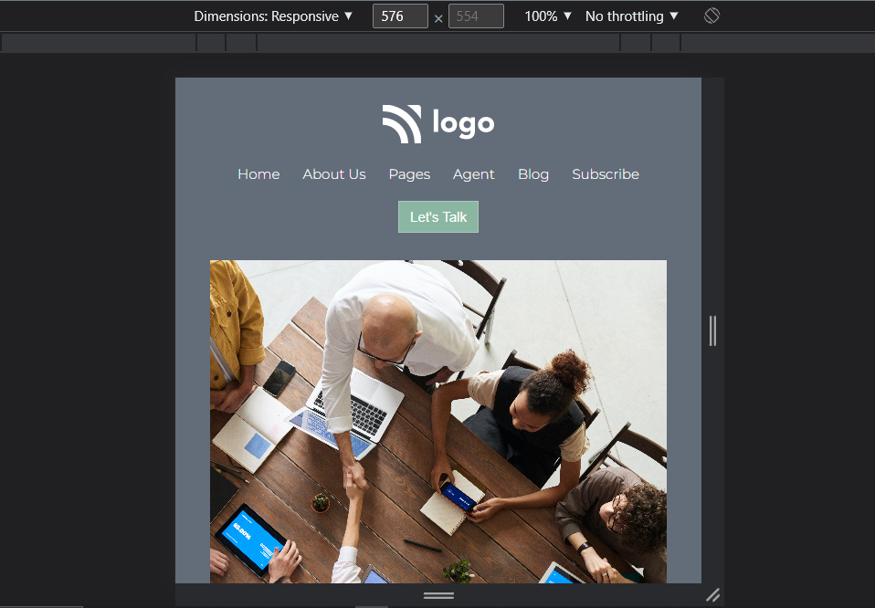
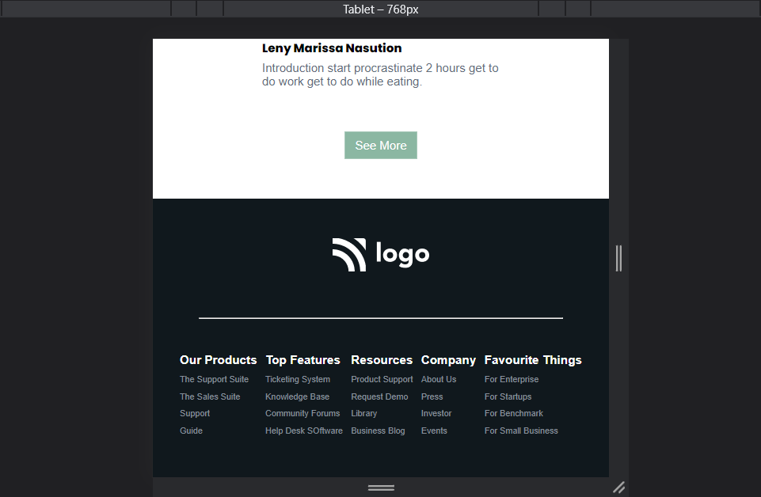

# Company's Business Solution Website Design Template : 12th Website in pure HTML and CSS

---

## Description
This is a landing page designed for a business solution firm in pure HTML and CSS. The overall design consists of multiple sections. The entire webpage is divided into multiple segments which are the navigation bar, intro section, cards section, service section, creative team introduction with images, and footer section with sitemap and social links. Each segment has its design paradigm based entirely on user engagement. All the buttons are designed with gradients and animations.
 

Most of the alignment with the elements was done using `Flexbox` and its various properties. In total, I gave 14-15 hours of my time, which was divided among several sittings. In the beginning, I spent a lot of time writing HTML segments where I declared all of the crucial components like the navbar, intro section, card sections, creative team, button designing, footer, and all of their images, and icons. Selecting the correct icons, images, and their size according to the color scheme was one of the challenging tasks for me. Eventually, I spent most of my time designing and maintaining the responsiveness of each object for multiple screen sizes. In this webpage, the responsive breakpoints are at `1024px`, `768px`, and `576px`.
 
The image property was an important element that I learned in this project. Correct cropping and aligning of images were necessary for this webpage. Specifically, I learned the correct usage of `object fit` and its properties like `contain`, `fill`, and `cover`. Apart from that, another property that taught me alignment of the element's content within the element's box is `object-position`. I used object position to correctly align the image within a particular dimension. This particular project has trained me more on `Flexbox`, `media queries, `images`, and properties along with designing aspects.

 

---

## About The Project
 

Here's a Screen-Shot of my 12th project along with the responsive snippets.

 

 

 

 

 

<!-- PROJECT LOGO -->
 

  

<h3 align="center">Project 12 - Business Solutions</h3>
  
   
    <a href="https://developer-website-project-12.netlify.app/">View Live Demo</a>
  

## Built With

**Using Technologies**

1. `HTML`
2. `CSS`
3. `MarkDown`

> The challenge of this project was to make the design responsive from scratch with pure CSS without using any frameworks .

 

## Live Project

This project is presently deployed in **`Netlify Service`**.

[Live Project URL](https://developer-website-project-12.netlify.app/)
 

<!-- LEARNT -->
 

## Learnt
In This project I learnt the following properties of HTML and CSS.
- In depth learning of Responsive designs.
- Image positioning properties
- Flexbox and its Properties. 
- Media Queries.

 
<!-- CONTACT -->

## Contact

- **Name 👨‍💻:** [Harshal Verma](https://github.com/harshalvrm)
- **Email 📧:** [harshalvrm3@gmail.com](mailto:harshalvrm3@gmail.com)
- **Linkedln 📝:** [Click Here](https://www.linkedin.com/in/harshalvrm3/)
- **Blog 📝:** [Hashnode blog](https://xadai.hashnode.dev/)

 

[Project 12 Link](https://developer-website-project-12.netlify.app/) 

